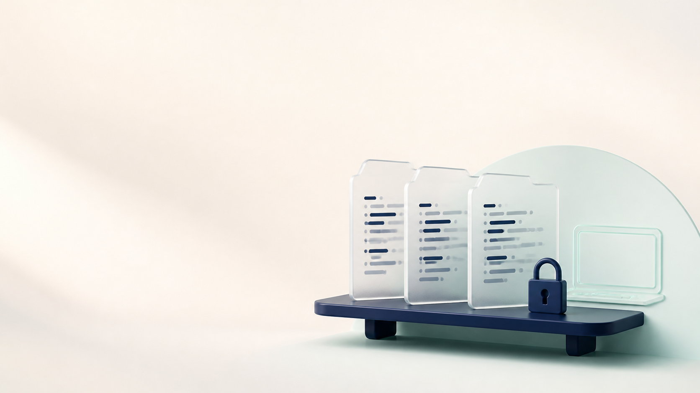

# EnvShelf

> **v0.1.1** — a local-first home for project environment metadata and encrypted `.env` backups.



EnvShelf keeps developer environment values on your machine while making the
boring parts easy: see projects, required environment-key names, backup state,
and Git origins in one local dashboard. Backups use the established `age` tool;
the dashboard never accepts, returns, or logs secret values.

The dashboard is local-only and metadata-only. It has a draggable project card workspace with Grid/List views, pins, paths, Git URLs, backup status, and safe environment-key rows (never values). Click a card for details; `Backup now` and typed-confirmation `Restore` are guarded server actions. The `New project` dialog clones into an explicit mounted root, so you can initialize projects from the UI without granting arbitrary host filesystem access.

## Start the dashboard

```sh
cp .env.example .env
mkdir -p projects keys
docker compose up --build
```

Open <http://localhost:8787>. The named Docker volume keeps the local catalog across container recreation. Stop it with `docker compose down`; this leaves the volume in place. By default, `./projects` and `./keys` are empty, explicit mounts. Set `ENVSHELF_PROJECTS_HOST_PATH`, `ENVSHELF_CATALOG_ROOT`, `ENVSHELF_ALLOWED_PROJECT_ROOTS`, and `ENVSHELF_KEYS_HOST_PATH` in `.env` to expose real locations; for host-path catalogs, the first two should be the same host root. The key mount remains read-only. The initializer accepts only paths beneath the listed container roots.

## Run without Docker

Python 3 users can run a native, loopback-only dashboard with one explicit
project root:

```sh
python3 standalone/run.py --projects-root "$HOME/Projects"
```

This mode stores its catalog in OS app data and sets `standalone: true` in
`/api/config`; it does not require Docker or a filesystem mount. The Tauri
EnvShelf Connect app exposes the same flow on macOS, Windows, and Linux. See
[`docs/standalone.md`](docs/standalone.md) for the platform paths and the
verified age sidecar resource plan.

The dashboard action routes require a registered project path under `ENVSHELF_PROJECT_ROOT`, a recipient at `ENVSHELF_RECIPIENT_FILE`, and an identity at `ENVSHELF_IDENTITY_FILE`. No path, key, or secret can be supplied by the browser request.

### Finder drag-and-drop on macOS

For literal drag-and-drop from Finder, build the optional native helper in
[`macos/EnvShelfDrop`](macos/EnvShelfDrop). It sends only the folder path,
display name, environment filenames, and credential-free Git origin to the
local dashboard. Configure the host project root in `ENVSHELF_CATALOG_ROOT`
and its container mount in `ENVSHELF_PROJECT_ROOT`; the server maps only paths
under that root and rejects symlinks/outside paths.

## CLI in one minute

Run natively with Python and `age` installed, or run the same commands through the Docker image:

```sh
python3 -m app.cli init \
  --identity-file ~/.config/envshelf/age/identity.txt \
  --recipient-file ~/.config/envshelf/age/recipient.txt
python3 -m app.cli register --slug my-api --repo https://github.com/me/my-api --path /path/to/my-api
python3 -m app.cli encrypt --slug my-api --recipient-file ~/.config/envshelf/age/recipient.txt
python3 -m app.cli restore --slug my-api --identity-file ~/.config/envshelf/age/identity.txt
```

The default encrypted output is `backups/my-api.env.age`. Existing plaintext is preserved as `.env.before-restore.<UTC timestamp>` before restore. The catalog contains metadata and paths only; it never contains environment values or private key contents.

## First and second machine

1. On the first machine, run `init` once and keep the identity file in a secure password-manager/Keychain-backed location. Keep the recipient file with the project tooling.
2. Commit only the encrypted `backups/<slug>.env.age` file and metadata that is safe for your repository. The private identity file must stay out of Git and out of the Docker image.
3. On another machine, clone the repository, install/run EnvShelf, copy the private identity into the same protected local key path, register the local project path, then run `restore`.
4. If the identity is lost, an age backup cannot be recovered. Test restore on a disposable checkout before relying on the workflow.

## Public-repository boundary

Safe to publish: EnvShelf source, `catalog.example.json`, documentation, and `.age` ciphertext encrypted to your recipient. Never publish: `.env` files, decrypted restore backups, age identity/private-key files, tokens, passwords, or logs containing them. Review `git diff` and `git status --ignored` before every push.

See [docs/quickstart.md](docs/quickstart.md), [docs/security.md](docs/security.md), and [docs/architecture.md](docs/architecture.md) for the complete workflow.

## Demo media

Watch the [six-second product preview](docs/assets/envshelf-preview.mp4), then
run the [reproducible synthetic dashboard demo](docs/demo.md). The preview is a
brand illustration; the demo is the real app flow using disposable metadata
only—never a real project, path, key, or environment value.
