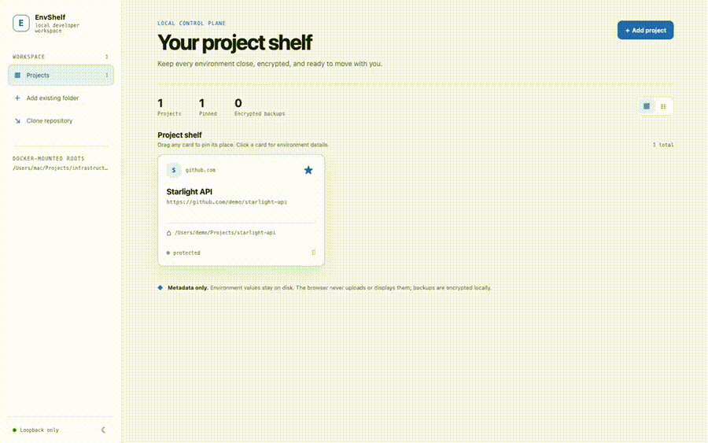

# EnvShelf

> **v0.1.2** · Local-first `.env` backups and a safe project environment dashboard.



[Watch the short UI video](docs/assets/envshelf-ui-walkthrough.mp4) · [Download the desktop app](https://github.com/ychetra/envshelf/releases/latest) · [See the demo](docs/demo.md)

EnvShelf keeps environment values on your machine. It shows only project metadata, environment-key names, and backup status; encryption is delegated to [`age`](https://age-encryption.org/).

## What it does

- Local dashboard: grid/list cards, pins, Git origin, key status, backup and typed restore.
- Encrypted backups: commit `.env.age` ciphertext, never `.env` plaintext.
- Docker or standalone: choose the setup that fits your machine.
- Native folder picker: EnvShelf Connect supports macOS, Windows, and Linux.

## Fast setup — Docker

Requires Docker Desktop (or Docker Engine with Compose).

```sh
git clone https://github.com/ychetra/envshelf.git
cd envshelf
cp .env.example .env
mkdir -p projects keys
docker compose up -d --build
```

Open <http://localhost:8787>. The dashboard is loopback-only and its catalog survives container recreation in a Docker volume.

### Use your existing Projects folder

Edit `.env`, then restart Compose. Use an absolute path; never put keys or environment values in this file.

```dotenv
ENVSHELF_PROJECTS_HOST_PATH=/absolute/path/to/Projects
ENVSHELF_CATALOG_ROOT=/absolute/path/to/Projects
ENVSHELF_ALLOWED_PROJECT_ROOTS=/workspace
```

```sh
docker compose up -d --build
```

On Windows, use a Docker Desktop-shared path such as `C:/Users/you/Projects`.

## Fast setup — no Docker

Requires Python 3. Run the local-only dashboard against one approved folder:

```sh
git clone https://github.com/ychetra/envshelf.git
cd envshelf
python3 standalone/run.py --projects-root "$HOME/Projects"
```

Open the printed `http://127.0.0.1:8787` URL. Its catalog stays in OS app data; project files never move or upload.

## Desktop app: EnvShelf Connect

1. Download **EnvShelf Connect** from the [latest release](https://github.com/ychetra/envshelf/releases/latest).
2. For standalone mode: choose **Open standalone dashboard**, then choose your Projects folder.
3. For Docker mode: drop/choose a project folder, choose the EnvShelf folder containing `docker-compose.yml`, then click **Approve & connect**.

Connect reads only the folder name, `.env*` filenames, and a credential-free Git remote. It never reads `.env` values or uses the Docker socket.

## Backup and restore commands

Install [`age`](https://age-encryption.org/) first. Keep the private identity in your password manager or another encrypted local store, never in Git.

```sh
# One time: create an age identity and recipient file.
python3 -m app.cli init \
  --identity-file ~/.config/envshelf/age/identity.txt \
  --recipient-file ~/.config/envshelf/age/recipient.txt

# Register a project (metadata only), then create encrypted backup.
python3 -m app.cli register --slug my-api --repo https://github.com/me/my-api --path /absolute/path/to/my-api
python3 -m app.cli encrypt --slug my-api --recipient-file ~/.config/envshelf/age/recipient.txt

# Restore later. Existing .env is first saved as .env.before-restore.<timestamp>.
python3 -m app.cli restore --slug my-api --identity-file ~/.config/envshelf/age/identity.txt
```

## Move to another machine

1. Clone the project containing the encrypted `backups/*.env.age` file.
2. Install EnvShelf and `age`.
3. Copy your private age identity from your encrypted password manager.
4. Register the new local checkout path, then run `restore`.

If the private identity is lost, the encrypted backup cannot be recovered.

## Safety rules

- Commit: source, metadata, and `.env.age` ciphertext.
- Never commit: `.env`, age identities, tokens, passwords, decrypted backups, or logs with values.
- The dashboard never displays or returns secret values.

More detail: [quickstart](docs/quickstart.md) · [security](docs/security.md) · [architecture](docs/architecture.md) · [standalone](docs/standalone.md) · [Connect](docs/connect.md).
